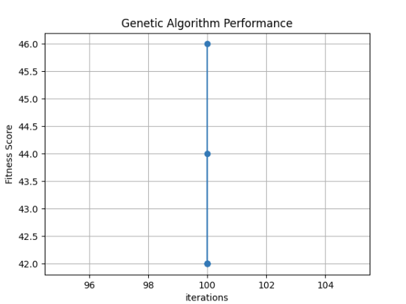
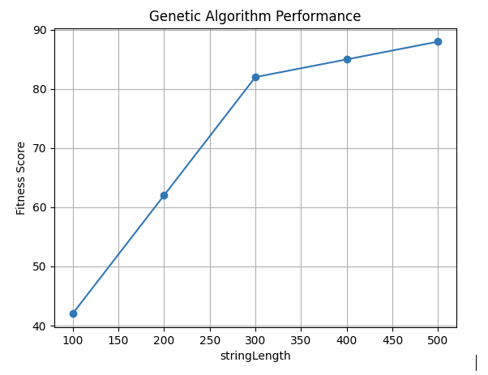
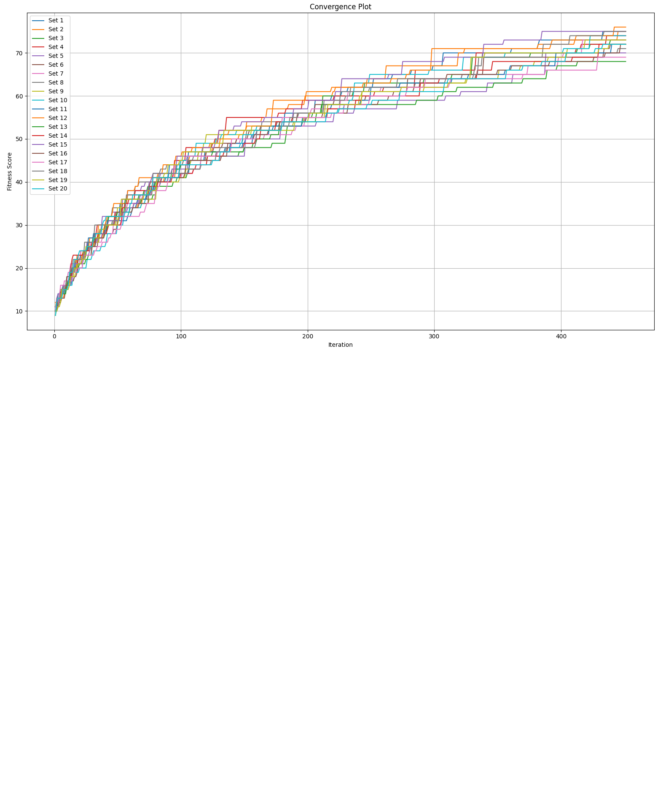
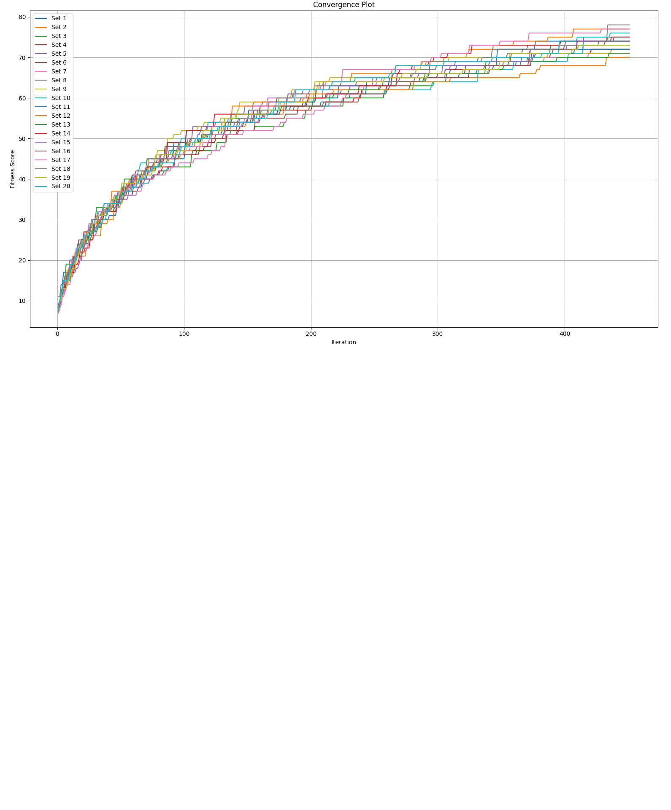

# Mastermind jellegű karaktersor kitaláló genetikus algoritmus készítése Pythonban

## Célkitűzés  
Egy olyan Python program készítése, ami képes paraméterezhető genetikus algoritmus segítségével kitalálni egy vagy több karaktersort.

## Használati módok

Az programot két módban lehet futtatni: egyetlen karakterlánc konfigurációval vagy több paraméterkészlettel a teljesítmény grafikonjának létrehozásához.

### A program futtatása egyetlen karakterlánc konfigurációval:
```bash
python script_name.py --single
```
## Függvények

A függvények dokumentációját a kód docstringek formájában tartalmazza.

## A genetikus algoritmus működése

Első lépésként képez egy kezdeti populációt véletlenszerű stringekkel. Utána iterációnként a következőket hajtja végre:

1. Kiszámolja az összes populációban lévő egyed fitness scoreját.
2. Kiválasztja az elitizmus mértéke szerint a lehetséges szülőket.
3. Képez populáció hossza - generált egyedek számú crossovert a következőképpen:
    1. Kiválaszt két véletlenszerű szülőt a potenciális szülőkből (akik eleve is benne maradnak a populációban)
    2. Majd ezen két szülőből crossoverNum crossovert képez, melyek mindegyikét mutálja is
4. A hátralévő üres helyekre új, véletlenszerűen generált stringeket helyez
5. Ellenőrzi, hogy a jelenlegi legjobb megoldás megegyezik-e a megoldással és, ha igen visszatér ennek értékével, nem fut feleslegesen és kiírja, hogy hányadik iterációban találta meg a legjobb megoldást, így könnyebb kiszűrni, ha feleslegesen sok iterációval próbálkoznánk.
6. Ha nem talált eddig (iterációk száma) teljesen megegyező megoldást, akkor visszaadja a jelenlegi legjobbat.

## Több eset vizsgálata

Az eddigiek leírták, hogy egy stringet miként próbálunk kitalálni, nézzük azt az esetet, amikor több beállítást szeretnénk összehasonlítani.

### Extra paraméterek
Ehhez két extra paramétert vezettem be:

```python
paramForGraph
```
 Ezzel meghatározhatjuk, hogy a több megoldást kiértékelő grafikon mely paraméter függvényében rajzolja ki a fitness függvény értékét.

```python:
parameterSets:
```
Ezzel egy tömbön belül dictionaryk segítségével különböző beállításokat próbálhatunk ki, például: 
```python 
{"string_length": 100, "population_size": 100, "iterations": 100, "elitism": 20, "crossover_num": 2, "random_generated_candidate_num": 10, "mutation_rate": 0.01}
```
### Grafikus megjelenítés
A grafikus megjelenítés, mivel kétdimenziós, csak akkor használható megfelelően, ha ezen paraméterekből csak az egyiket változtatjuk egy adott futtatásnál.

### Algoritmus futtatása különböző beállításokkal
Több beállításos esetben minden egyes beállításra lefuttatjuk az algoritmust, mindig más stringre, de ennek az eleve való véletlenszerűsége miatt nem tulajdonítok különösebb jelentőséget.

### Eredmények ábrázolása
Az egyes megoldások legjobb delikvensének fitness scoreját eltároljuk egy dictionarybe a grafikon másik paraméterének értékével együtt. 

Ezt követően a 
```python
generatePlot(results, paramForGraph) 
```
függvénnyel kirajzoljuk a megfelelő grafikont. Mivel azonos beállítások fitness scoreját más hosszúságú stringekkel nem éri meg összehasonlítani a fitness score és a string hosszának egyenes arányossága miatt, ezért ilyen esetben mindig a fitness score / string hossz értéket jeleníti meg, így látjuk, hogy mekkora részét találta el a generált stringnek.

## Naplózás

A program futása során a következő adatokat naplózzuk a log.txt fájlba:

- GAConfig: Az algoritmus konfigurációs beállításai.
- Teszt string: Az algoritmus által kitalálni próbált cél string.
- Legjobb megoldás: Az algoritmus által talált legjobb megoldás.
- Fitness score: A legjobb megoldás fitness score-ja.

Ezzel biztosítjuk, hogy a futások eredményei visszakövethetőek és dokumentáltak legyenek. 

## Grafikonok

Mindig öt példával dolgozom, legyen az alapbeállítás a következő (ha explicit nem utalok másra, mindig ez az egyes vizsgálatok kiindulópontja):

```python
{"string_length": 100, "population_size": 100, "iterations": 100, "elitism": 20, "crossover_num": 2, "random_generated_candidate_num": 10, "mutation_rate": 0.01}
```

Többször futtatva a következő fitness score eredményeket kaptam:  


Ezen látszik, hogy ez a beállítás nagyjából 42-46 közötti fitness scoreokat eredményez (ezesetben lényegtelen, hogy mely paraméter függvényében, mivel mindegyik eset beállítása azonos).

### Különböző string hosszúságok vizsgálata

Ellenőrizzük ezeket a beállításokat 100, 200, ..., 500 karakter hosszú stringekre.


Látjuk, hogy azonos beállítások eltérő string hosszakra egyre kevésbé megfelelőek, amelyet főként a populáció nagysága és az iterációk száma befolyásol.

Érdekességképpen, ha a fitness scoret nem osztottam volna le a string hosszával:



Látható, hogy a fitness scoreok emelkednek, de közel sem olyan ütemben, mint a string hossza.

### Populáció méretének vizsgálata

Ellenőrizzük az eredeti a beállításokat 100, 200, ..., 500 méretű populációkra (vagyis a string hossza újra 100 minden esetben).


Gyökfüggvényre emlékeztető formában emelte az algoritmus teljesítményét, 500 iterációnál már majdnem eltalálta a megoldást.

### Iterációk számának vizsgálata

Ellenőrizzük az eredeti a beállításokat 100, 200, ..., 500 iterációra.


Szintén gyökfüggvényszerű emelkedés tapasztalunk.

Érdekességképpen az emelkedő iterációs beállításnál emelem a populáció nagyságát is azonos módon (100, 200, ..., 500).


A populáció 400, illetve 500-ra emelése után már 275 és 166 iterációban alatt megtalálta a tökéletes megoldást, vagyis ebből arra következtetek, hogy a populáció nagyságának emelése és az iterációk emelése nem ajánlott azonos mértékben, mivel a populáció emelésével kevesebb iterációból megtalálható a tökéletes megoldás és ez felesleges iterációkat eredményezhet.

### Elitizmus hatása

Visszaállítottam mindent az eredeti beállításokra. Ellenőrizzük az elitizmus hatását az algoritmus teljesítményére. 20, 40, 60, 80, 90 értékeket kapott. Az utolsó esetben azért nem 100, hogy a generált értékek általi diverzitást ne veszítsük el.


A növekvő elitizmus láthatóan rosszabb megoldást eredményezett, mivel minden esetben nagyon sok egyed maradt meg az első generálás után változatlanul.

### Crossoverek számának vizsgálata

Változtassuk a crossoverek számát. Mindig a populáció és a generált elemek számának különbségének az osztójának kell lennie. Esetünkben ez 100-10 = 90, miatt a 2, 5, 9, 15, 18-at választottam.


Az eredmények meglehetősen eltérőek, bár alapvetően csökkenő tendenciát mutatnak.

### Generált értékek száma

Változtassuk meg a generált értékek számát (10, 20, ..., 50).


Ez szintén csökkenő fitness scoret eredményezett, valószínűleg a túlzott mennyiségű véletlen és egymástól független opció miatt.

### Mutáció valószínűségének vizsgálata

Végezetül a crossoverek mutációjának valószínűségét emeljük 0.01, 0.05, 0.10, 0.15, 0.20 értékekre. Többszöri próbálkozásból nyugodtan kijelenthetem, hogy az 5%-os mutációs esély adja a legjobb fitness score értékeket.  


### Összegzés

Ezek alapján egy legoptimálisabb beállításként a következőre következtetek egy 100 karakteres string kitalálására:

Population: 600, Iterations: 300, Mutation rate: 0.05, minden más az eredeti állapotban marad. Meglepő, de ezzel a beállítással maximum 95-ös fitness scoret tudtam elérni. A mutation rate 0.01-re való visszaállításával viszont potenciálisan 250 iterációból tökéletes megoldásra jutott az algoritmus. Ebből következően az általam megtalált egyik legoptimálisabb beállítás egy 100 karakteres stringre:

```python
stringLength = 100  
populationSize = 600  
iterations = 300  
elitism = 20  
crossoverNum = 2  
random_generated_candidate_num = 10  
mutationRate = 0.01
```
### Több futtatás egy grafikonon ábrázolása

Amikor több beállítással futtatjuk az algoritmust, az összes konvergencia-grafikon látható lesz egyetlen ábrán, ami lehetővé teszi az eredmények összehasonlítását és a teljesítményelemzést. Minden futtatás egy külön vonalat képvisel a grafikonon, amely az iterációk számát mutatja az adott futtatás során elért legjobb fitness értékkel.

#### Növekvő populáció

A grafikon az alapbeállításokkal készült, 100-anként növekvő populációval. Ezesetben a 400-as populáció éppen egy picit jobb eredményt ért el, mint az 500-as.


#### Azonos paraméterek vizsgálata

A grafikon az alapbeállításokkal készült. 20 futtatást követően a minimum és maximum fitness score közötti különbség nagyjából 10 volt.


A következő grafikont először a 
```python 
{"string_length": 4000, "population_size": 1000, "iterations": 1000, "elitism": 300, "crossover_num": 10, "random_generated_candidate_num": 400, "mutation_rate": 0.05}
```
beállításokkal próbáltam elkészíteni. 20 futtatást adtam meg, de 20 perc várakozás után feladtam. Végülis 4000 karakteres stringből 1000-et generálni, mindegyikre fitness scoret számolni, majd 400 új stringet generálni, majd 300 crossovert készíteni, úgy, hogy mindegyik (300*4000 karakteren végigiterálni), mindezt 1000-szer és az egészet 20-szor talán egy kicsit nagy feladat egy átlagos otthoni PC-nek.

Csökkentettem az elvárásokat
```python 
{"string_length": 1000, "population_size": 400, "iterations": 450, "elitism": 300, "crossover_num": 10, "random_generated_candidate_num": 400, "mutation_rate": 0.05}
```
beállításokkal készült. 20 futtatást követően a minimum és maximum fitness score közötti különbség nagyjából 5 volt. Nem születtek szép eredmények, 1000-ből 30 karaktert aligha tudott eltalálni. Az iterációk fele után, már nem sok esetben tudott javulást elérni, meglehetősen megakadt egy típusú megoldásnál. Ez 34 percig futott.

NOTE! (Ez a megjegyzés egy komoly felismerés pillanatában került ide.)
A population_size-al olyan sokra nem mentem, mivel az a kezdeti populáció méretét határozza meg. Szóval ezesetben a legjobb 300-at megtartotta, majd 400 újat generált és sosem történt crossover.


Tovább csökkentettem az elvárást, a stringek hosszát levettem 400-ra, illetve az elitizmus mértéke kissé túlzó lehetett, úgyhogy lejjebb vettem 150-re. A populációt felemeltem 600-ra, a generált egyedek szám pedig 350. 150+350=500, szóval 100 crossover fog készülni.
Beállítás:
```python 
{"string_length": 400, "population_size": 600, "iterations": 450, "elitism": 150, "crossover_num": 10, "random_generated_candidate_num": 350, "mutation_rate": 0.05}
```
20 futtatást követően a minimum és maximum fitness score közötti különbség nagyjából 13 volt. Ez 18 percig futott.


Tovább csökkentettem az elvárást, a stringek hosszát levettem 300-ra. Felemeltem a mutációs rátát 10%-ra, mivel a 10 crossover azonos szülőkből készül, a nagyobb mutációs ráta jobb diverzitást eredményez, ez által nagyobb szórást várok el.
Beállítás:
```python 
{"string_length": 300, "population_size": 600, "iterations": 450, "elitism": 150, "crossover_num": 10, "random_generated_candidate_num": 350, "mutation_rate": 0.1}
```
20 futtatást követően a minimum és maximum fitness score közötti különbség nagyjából 8 volt. Ez 9 percig futott.



Le a kékvérűekkel! az elitizmust lecsökkentettem 100-ra. Tovább csökkentettem az elvárást, a stringek hosszát levettem 200-ra.
Beállítás:
```python 
{"string_length": 200, "population_size": 600, "iterations": 450, "elitism": 100, "crossover_num": 10, "random_generated_candidate_num": 350, "mutation_rate": 0.1}
```
20 futtatást követően a minimum és maximum fitness score közötti különbség nagyjából 8 volt. Ez 6 percig futott.



Egyre jobban látható, hogy nem áll meg a fejlődés, csak időre lenne még szükség. Felemeltem az iterációk számát 700-ra. A string hosszát levettem 150-re. A crossoverek számát csökkentettem 2-re, hogy minél több szülő génjei öröklődhessenek. A generált elemek számát csökkentettem 100-ra, hogy növeljem a crossoverek számát. A mutációs rátát csökkentettem 0.01-re, hogy a szülő gének erősek maradjanak.
Beállítás:
```python 
{"string_length": 150, "population_size": 600, "iterations": 700, "elitism": 100, "crossover_num": 2, "random_generated_candidate_num": 100, "mutation_rate": 0.01}
```

Ahogy látható ez a beállítás több tökéletes megoldást is eredményezett a legrosszabb 149 volt. Az elitizmusból készített crossoverek hatékonyak, ha kellő teret hagyunk nekik.


### Összegzés 2

Hasonlítsuk össze a mostani beállítást az első "optimális" beállítással!

Többszörös:
```python 
{"string_length": 150, "population_size": 600, "iterations": 700, "elitism": 100, "crossover_num": 2, "random_generated_candidate_num": 100, "mutation_rate": 0.01}
```

Első:

```python 
stringLength = 100  
populationSize = 600  
iterations = 300  
elitism = 20  
crossoverNum = 2  
random_generated_candidate_num = 10  
mutationRate = 0.01
```

A populáció mérete egyezik, bár ezt főként a számítógép teljesítménye határozta meg. Lényegesen magasabb elitizmusra jutottam, ahogy a generált elemek száma is magasabb. A crossoverek hiányában kétszer annyi iterációra volt szükség hasonló minőségű megoldásokhoz. Bár a jelen tesztek cask szemléltető jelleggűek, ezek alapján olyan genetikus algoritmusokat preferálnék, amelyek rengeteg crossovert képeznek.


<h3 style="text-align: right;">Jakab Benedek (KZXLAC)</h3>